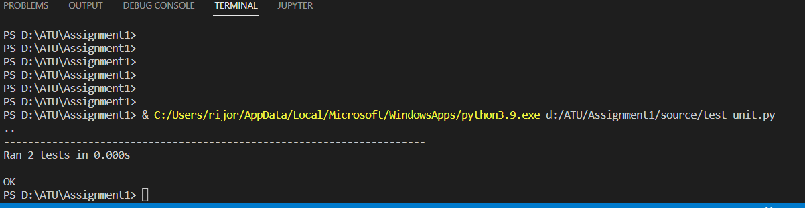

# DHCP Log Checker

## Table of Contents
**[Description](#description)**<br>
**[Functionalities](#functionalities)**<br>
**[Overview](#overview)**<br>
**[Unit Testing](#unit-testing)**<br>
**[Authors](#authors)**<br>

## Description
The DHCP log checker script is used to read, parse and find out the vendor details using the mac address. This script generates a csv file with ip, mac, hostname, vendor details from the dhcp log. For the vendor details, the student is using a predefined dictionary list. The source modules used in the script are not standalone scripts except vendor.py.

## Functionalities
The below are the functionalities used in the script.

### main.py
In the main.py script, the student is calling the functionalities in order to get the desired output. Also we are mentioning the DHCP log file path. To execute the script, go to the projrct directory and enter below command.
```python
python main.py
```
### read_log.py
Using below code, parsing the DHCP log file from the 34th position.
```python
payload = myline[34:]
```
once it is completed, the parsed values are passed through the if loop to get the values with "DHCPACK on".
```python
if list_of_values[0] == "DHCPACK" and list_of_values[1] == "on":
```
Then the values are passed to the dhcpack function in filter.py for further processing. Once the processing is completed, the returned values will be IP, MAC, HOST, Vendor. These values will be passed to main.py.

### filter.py
using below code method, the required values are parsed from the list.
```python
ipv4.append(list_of_values[2])
```
Once we get the mac list, passing the values to vendor functionality for getting the vendor details. the final list will be concatinated at the end of the script and returned to main.py

### vendor.py
This script can be used as a standalone function and called by main script. In this script it will check for the first 8 characters and get the details from the dictionary. splicing the first 8 characters using below code. The final result will be passed to filter.py.
```python
oui_cutting=oui[0:8]
```

### csv_creator.py
Once the final list is created, the main.py will pass the list to csv_creator functionality. The csv_creator will convert the list of values to csv format using below code. For the csv creator, python built in csv functionality.
```python
with open(filename, 'w', encoding="utf-8") as outcsv:
    writer = csv.writer(outcsv, delimiter=',', quotechar='|',
    quoting=csv.QUOTE_MINIMAL, lineterminator='\n')
    writer.writerows([('IP', 'MAC', 'HOST', 'VENDOR')])
    writer.writerows(new)
```

## Overview
The student was able understand the functioning of corporate projects. The assignment given by the lecturer has been completed successfully and documented the results. 

## Unit Testing
Unit testing has been coompleted using below code.
```python
class TestDhcpLog(unittest.TestCase):
  
    def test_findvendor(self):
        get_mac_vendor_result = findvendor("a4:4c:c8")
        self.assertEqual(get_mac_vendor_result, "Dell Inc")
```
The test results are shown below.



## Authors
DHCP Log Checker tool was developed as a part of Infrastructure as Code module's assignment by Rijo Robert.