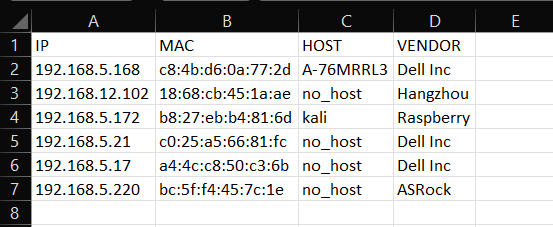

# DHCP Log Checker

### Table of Contents
**[Description](#description)**<br>
**[Requirements](#requirements)**<br>
**[Tested On](#tested-on)**<br>
**[Sample Execution](#sample-execution)**<br>
**[Output](#output)**<br>
**[Functionalities](#functionalities)**<br>
**[Authors](#authors)**<br>

## Description
The DHCP log checker script is used to read, parse and find out the vendor details using the mac address. This script generates a csv file with ip, mac, hostname, vendor details from the dhcp log. For the vendor details, the student is using a predefined dictionary list. The source modules used in the script are not standalone scripts except vendor.py.

## Requirements
- Operating System :  Windows-10
- Python :   Version 3.9

## Tested On
Windows-10-10.0.22621-SP0 with Python version 3.9.13

## Sample Execution
Go to the project directory and run below command :

```python
python main.py
```
## Output
The generated csv file will have below details from the DHCP log file:

- IP Address
- MAC address
- Hostname
- VENDOR

 


## Functionalities
| Script | Description |
| ----------- | ----------- |
| project.bat | Batch file to create project structure |
| main.py | DHCP log checker |
| csv_creator.py | To convert the final list of values to csv file |
| filter.py | Parse the dhcp log file |
| read_log.py | Reading the dhcp log file |
| unique_values.py | To clear out the duplicate values |
| vendor.py | Get the vendor names from mac address |

## Authors
DHCP Log Checker tool was developed as a part of Infrastructure as Code module's assignment by Rijo Robert.